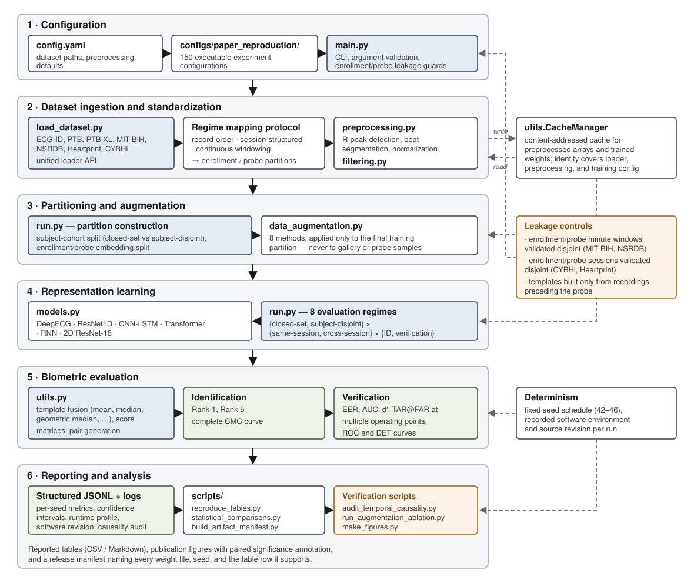

# ECG-Biometrics-Bench  
### A Unified Framework for Realistic and Reproducible ECG Biometrics Evaluation

[](https://github.com/MParvan/ecg-biometrics-bench/actions/workflows/tests.yml)
[](https://www.python.org/downloads/)
[](LICENSE)

---

## 🚨 The Problem

Most ECG biometric systems report near-perfect performance (≈99% accuracy).

However, these results are often **misleading**.

A large portion of the literature relies on:
- Random intra-session train/test splits  
- Overlapping temporal segments  
- Closed-set evaluation protocols  

These practices introduce **data leakage** and artificially inflate performance.

➡️ When evaluated under realistic conditions (cross-session, unseen subjects), performance **drops dramatically**.

---

## 💡 Key Insight

### Performance Inflation Under Random Intra-Session Splitting

Randomly dividing temporally adjacent ECG samples from the same recording
session between training and testing can produce optimistic performance
estimates. The model may exploit session-specific or near-neighbor
similarities that are unlikely to remain stable across time or unseen
subjects.

In this project, **Random Split Fallacy** is used as shorthand for this
specific form of performance inflation. The term does not imply that every
random split is invalid. Its suitability depends on the intended experimental
claim and whether temporal or subject-level generalization is being assessed.

Across multiple datasets and models, we show:

- Intra-session (random split): ~95–100% accuracy  
- Cross-session / realistic: **significant degradation (often <70%)**

This suggests current methods may **not generalize to real-world deployment**.

---

## 🧠 What This Repository Provides

ECG-Biometrics-Bench is a **modular, reproducible benchmarking framework** for ECG-based biometric systems.

It standardizes the full pipeline:

- Dataset ingestion across heterogeneous ECG datasets  
- Signal preprocessing and segmentation  
- Model training (CNN, LSTM, hybrid architectures)  
- Evaluation under realistic biometric protocols  

The framework enables **fair comparison across models, datasets, and evaluation settings**.

---

## ⚙️ Key Features

- 🔄 **Unified Dataset Interface**
  - Supports multiple public ECG datasets (ECG-ID, PTB, CYBHi, MIT-BIH, etc.)
  - Handles heterogeneous formats and structures

- 🧩 **Modular Pipeline**
  - Filtering, segmentation, augmentation, modeling, evaluation
  - Easily extensible for new methods

- 📊 **Rigorous Evaluation Protocols**
  - Known-subject and subject-disjoint evaluation
  - Intra-session and cross-session evaluation
  - Long-term temporal evaluation

- 🧪 **Reproducible Experiments**
  - Config-driven pipeline
  - Consistent preprocessing and evaluation across datasets

- 📉 **Realistic Benchmarking**
  - Explicitly avoids data leakage
  - Highlights performance degradation under real conditions

---

## Evaluation Terminology

In this repository, **subject-disjoint evaluation** means that the identities
used for biometric evaluation are excluded from the identities used to train
the feature extractor.

This setting evaluates generalization to previously unseen subjects, but it
should not be confused with a complete open-set identification system.
Open-set identification additionally requires the system to detect or reject
a probe that does not correspond to any enrolled identity.

Accordingly:

- Tasks 1, 2, 5, and 6 evaluate subjects represented during model training.
- Tasks 3, 4, 7, and 8 evaluate subjects excluded from model training.
- Identification remains a 1:N search among the identities enrolled in the
  evaluation gallery.
- Verification evaluates genuine and impostor comparisons for the relevant
  evaluation cohort.

---

## 🗄️ Supported Datasets

The framework provides plug-and-play automated download and parsing for the following datasets:

1. **ECG-ID**: 90 subjects, varied short-term/long-term sessions. The framework uses the hardware-filtered ECG channel by default; pass `--signal_type raw` to select the unfiltered channel explicitly.
2. **PTB**: 290 subjects (includes healthy controls and clinical pathologies).
3. **MIT-BIH Arrhythmia**: 47 subjects, continuous 30-minute Holter recordings.
4. **NSRDB**: 18 subjects, extremely long-term 24-hour continuous recordings.
5. **PTB-XL**: Massive 21k+ clinical record database (10-second segments).
6. **HeartPrint**: Highly structured multi-session dataset (Baseline, Post-Exercise, Cognitive tasks, Temporal separation).
7. **CYBHi**: Designed for short-term and long-term (3-month gap) biometric stability.

---

## 🗺️ The Regime Mapping Protocol

Public ECG datasets have incompatible temporal structures, so a single split
rule cannot apply to all of them. The regime mapping protocol decouples the
physical organization of a dataset from its logical biometric use. Datasets
fall into three categories, each with a different enrollment/probe rule.

### Category 1 — Record-order datasets (ECG-ID, PTB, PTB-XL)

Multiple recordings per subject with no uniform session structure. Recordings
are sorted by `(date, record order)` and partitioned deterministically. The
rules live in `select_record_order_partition` in [load_dataset.py](load_dataset.py)
and are used by both the loaders and the audit tool.

| `--data_split_mode` | Enrollment | Probe | Measures |
|---|---|---|---|
| `single-cross-session` | recording 1 | recording 2 | cross-record stability |
| `single-shot-short-term` | first recording of day 1 | remaining day-1 recordings | minimal enrollment, same day |
| `leave-last-out-short-term` | all day-1 recordings except the last | last day-1 recording | multi-shot enrollment, same day |
| `single-shot-long-term` | all day-1 recordings | all recordings from later days | template aging |
| `leave-last-out-long-term` | all recordings before the last day | all recordings on the last day | multi-session fusion vs aging |

Subjects lacking the structure a regime requires (for example, only one
recording when two are needed) are dropped, and the count is printed. In all
five regimes the enrollment partition consists only of recordings that precede
the probe recordings.

> **Note on PTB dates.** PTB records without a parseable timestamp receive
> synthetic sequential dates from a counter that advances across the dataset.
> Record *order* is therefore always well defined, but for those records the
> "long-term" regimes separate by file order rather than by measured elapsed
> time. ECG-ID and PTB-XL use real acquisition dates.

### Category 2 — Session-structured datasets (CYBHi, Heartprint)

Sessions are provided by the dataset, so they are used directly. Enrollment and
probe sessions are named explicitly and validated to be disjoint:

```bash
python main.py --dataset heartprint --task 6 \
  --data_split_mode cross-session \
  --train_sessions session1 session2 \
  --probe_sessions session3r
```

CYBHi exposes `short-term_CI`, `short-term_A1`, `short-term_A2`,
`long-term_S1`, and `long-term_S2`. Heartprint exposes `session1`, `session2`,
`session3l`, and `session3r`.

### Category 3 — Continuous recordings (MIT-BIH, NSRDB)

One continuous signal per subject, so file-based splitting does not apply.
Session-based evaluation is replaced by deterministic temporal windowing over
explicit minute ranges, validated to be non-overlapping:

```bash
python main.py --dataset mitbih --task 6 \
  --data_split_mode custom-split \
  --train_parts 0 5 --train_parts 12.5 17.5 \
  --enrol_parts 0 5 --enrol_parts 12.5 17.5 \
  --test_parts 25 30
```

The windows used for the reported results are listed in
[configs/paper_reproduction/README.md](configs/paper_reproduction/README.md).

---

## 🚀 Installation & Quick Start

To prevent dependency conflicts with other projects on your machine, it is highly recommended to install the framework inside a virtual environment.

**Option A: Using Python's built-in `venv`**
```bash
# 1. Create the virtual environment named "ecg_env"
python -m venv ecg_env

# 2. Activate the environment
# On Windows:
ecg_env\Scripts\activate
# On macOS and Linux:
source ecg_env/bin/activate
```
**Option B: Using Conda (Anaconda/Miniconda)**
```bash
# 1. Create the conda environment (Python 3.9+ recommended)
conda create -n ecg_env python=3.10 -y

# 2. Activate the environment
conda activate ecg_env
```
Once your virtual environment is activated, you can proceed with the standard installation:
```bash
git clone https://github.com/MParvan/ecg-biometrics-bench.git
cd ecg-biometrics-bench
pip install -r requirements.txt
```

Dependency versions are pinned to the environment used to produce the reported
results, running Python 3.10.

**CPU and GPU.** The same installation runs on either. The framework detects
the available device at runtime and falls back to CPU, and `--device cpu`
forces it. For GPU acceleration, install the CUDA build of PyTorch *before*
the requirements file, because the default PyPI wheel is CPU-only on Windows:

```bash
pip install torch==2.4.1 torchvision==0.19.1 --index-url https://download.pytorch.org/whl/cu124
pip install -r requirements.txt
```

Match the index URL to your CUDA version; see
[pytorch.org](https://pytorch.org/get-started/locally/). On CPU the framework
is fully functional but slow, so prefer a single dataset or a reduced epoch
count when exploring:

```bash
python -m scripts.reproduce_tables --dataset ecgid --run --smoke
```

**Optional representations.** The two-dimensional time–frequency
representations in `representation.py` (Mel-spectrogram, Gramian angular
fields, S-transform, Wigner–Ville) need extra packages that the core pipeline
never imports. They are kept separate because one of them builds a C
extension, and a failed build would otherwise abort the whole installation:

```bash
pip install -r requirements-representations.txt
```

**Running the tests.** The test suite needs one extra package:

```bash
pip install -r requirements-dev.txt
python -m pytest tests -q
```

---

## 📥 Acquiring the datasets

Every dataset is downloaded and unpacked on first use, so no manual step is
normally required. To fetch and check all of them up front, and get one table
describing what arrived:

```bash
python -m scripts.verify_datasets
```

The script reports each dataset as `ok`, `already-present`, `missing-tool`, or
`failed`, and exits non-zero if any dataset could not be acquired. Add
`--output-json report.json` to keep the full detail, or `--datasets ecgid ptb`
to check a subset. Only acquisition is exercised: no signals are parsed, so the
run takes as long as the transfers and needs no GPU.

**One external dependency.** Six of the seven datasets are published as ZIP
archives, which Python unpacks on its own. HeartPrint is published as a RAR
archive, and Python has no built-in RAR decoder, so unpacking it needs a tool
from the operating system:

```bash
# Debian, Ubuntu, and Google Colab
apt-get install -y unar

# macOS
brew install unar

# Windows: install 7-Zip or WinRAR
```

To check what is available before downloading anything:

```bash
python -m scripts.verify_datasets --check-tools
```

If no such tool can be installed, download `Heartprint.rar` from the
[published record](https://doi.org/10.6084/m9.figshare.20105354.v3) and unpack
it by hand into `datasets/heartprint/`; the loader scans for the session
directories at any depth, so the exact nesting does not matter.

**Disk space.** The archives are kept after unpacking so an interrupted run can
resume without downloading again. Pass `--delete-archives` to remove each one
once it is unpacked, which roughly halves the peak requirement — worth doing on
a Colab instance, where PTB and PTB-XL dominate the total.

---

The framework includes main.py which can simply be used as CLI. Some examples are as follows:

Experiment 1: Baseline Closed-Set Identification (Task 1)
Train a model to recognize known subjects from the ECG-ID dataset using the standard Softmax classifier.
```bash
python main.py \
  --dataset ecgid \
  --task 1 \
  --data_split_mode single-shot-short-term \
  --model deepecg \
  --epochs 150 \
  --batch_size 256 \
  --save_results
```

Experiment 2: Subject-Disjoint Verification with Template Matching (Task 4)
Train the feature extractor on Subject Group A, then evaluate 1:1 verification
on entirely unseen Subject Group B from the PTB dataset.
```bash
python main.py \
  --dataset ptb \
  --task 4 \
  --data_split_mode all-available \
  --use_template \
  --template_size 5 \
  --matching_method cosine \
  --num_pairs 10000 \
  --save_results
```

Experiment 3: Cross-Session Temporal Robustness (Task 5)
Test how well the model handles physiological aging. Train/enroll subjects using their session1 recordings from the HeartPrint dataset, and probe them using their session2 recordings.
```bash
python main.py \
  --dataset heartprint \
  --task 5 \
  --data_split_mode cross-session \
  --train_sessions session1 \
  --probe_sessions session2 \
  --use_template \
  --template_fusion_method mean \
  --save_results
```

Experiment 4: The Ultimate Test - Disjoint Cross-Session Verification with SQI (Task 8)
The hardest biometric scenario. The model learns representations on Session 1 (Group A). It then enrolls unseen subjects (Group B) using their Session 1 data, and verifies them using their Session 2 data. We also enable dynamic Kurtosis SQI filtering to automatically drop noisy beats.
```bash
python main.py \
  --dataset cybhi \
  --task 8 \
  --data_split_mode cross-session \
  --train_sessions short-term_CI \
  --probe_sessions short-term_A2 \
  --use_template \
  --template_size 5 \
  --outlier_filtering_on_train \
  --outlier_filtering_on_test \
  --sqi_method kurtosis \
  --sqi_threshold 0.05 \
  --save_results \
  --visualize
```

You can simply run these experiments in the main folder of the project by opening a command prompt or powershell (if you are using a windows) and run the commands. Alternatively you can see the example usage of Experiment 1 using google colab: 

[](https://colab.research.google.com/github/MParvan/ecg-biometrics-bench/blob/main/experiments/Experiment_1.ipynb)

This interactive notebook will automatically:
1. Clone the repository into the Colab environment.
2. Install the necessary dependencies from `requirements.txt`.
3. Execute the **Baseline Closed-Set Identification (Task 1)** command step-by-step so you can see the pipeline in action without setting up a local environment.


---

## 🏗️ Framework Architecture



The framework decomposes the biometric pipeline into six stages with
standardized interfaces between them, so a change to one stage cannot
silently alter another. The vector source is [docs/architecture.svg](docs/architecture.svg)
and an editable Mermaid version is [docs/architecture.mmd](docs/architecture.mmd).

| Stage | Module | Responsibility |
|---|---|---|
| 1. Configuration | `main.py`, `config.yaml`, `configs/` | CLI and YAML resolution, argument validation, leakage guards |
| 2. Ingestion | `load_dataset.py`, `preprocessing.py`, `filtering.py` | Unified loader API for 7 datasets, regime mapping, filtering and segmentation |
| 3. Partitioning | `run.py`, `data_augmentation.py` | Subject-cohort and sample partitioning, training-only augmentation |
| 4. Learning | `models.py`, `run.py` | Architecture-agnostic training across 8 evaluation regimes |
| 5. Evaluation | `utils.py` | Template fusion, matching, identification and verification metrics |
| 6. Reporting | `run.py`, `scripts/` | Structured records, tables, figures, audits, artifact manifests |

---

## ✅ Recommended Minimum Reporting Protocol

Reported ECG biometric performance is not comparable across studies unless the
evaluation conditions are stated. We recommend that future work report the
following as a minimum. Every item is produced automatically by this framework.

**1. Subject-disjoint results, not only closed-set results.**
Closed-set accuracy measures whether a model can separate identities it was
trained on. It does not measure whether the learned representation
generalizes. Report both, and label them explicitly.

**2. Cross-session results wherever the dataset supports them.**
Same-session evaluation is a weak upper bound. If a dataset has session
structure, report the cross-session number as the headline result. If it does
not, say so rather than presenting a same-session number as if it were
comparable.

**3. Verification metrics, not identification accuracy alone.**
Rank-1 accuracy depends on gallery size and is not comparable across datasets
or cohort sizes. Report EER and TAR at a stated FAR alongside it. State the
FAR explicitly: `TAR@0.1%FAR`, never `TAR@FAR`.

**4. The exact dataset version and subject count used.**
Include the number of subjects actually evaluated after any filtering, and
state what was filtered and why. A result on a healthy-only subset is not
comparable to one on the full cohort.

**5. The complete preprocessing configuration.**
Filter type and cutoffs, R-peak detector, segmentation window, and
normalization. This framework stores the effective configuration in every
experiment record, so it can be quoted rather than reconstructed.

**6. Variability across seeds, with an interval.**
A single run is not a result. Report the mean over several seeds together with
a confidence interval, and use a paired test when comparing conditions that
share seeds.

**7. How enrollment and probe data were separated.**
State which recordings, sessions, or time windows formed the enrollment set
and which formed the probe set, and confirm they are disjoint. This is the
single most common source of inflated results.

**8. Released code and configurations.**
A configuration file that runs end to end is worth more than a methods
paragraph.

### Verifying items 6-8 in this framework

```bash
# 6. Confidence intervals are written into every experiment record
#    under "across_seed_uncertainty", and paired tests are available:
python -m scripts.statistical_comparisons --manifest comparison_manifest.yaml

# 7. Confirm enrollment never uses probe or future data, without training:
python -m scripts.audit_temporal_causality --config <configuration.yaml>

# 8. Reproduce a reported table from the shipped configurations:
python -m scripts.reproduce_tables --table 5 --run
python -m scripts.reproduce_tables --table 5 --collect
```

---

## 🔒 Leakage Controls

The framework refuses configurations that would place the same physical
samples on both sides of an enrollment/probe comparison.

**Continuous recordings (MIT-BIH, NSRDB).** These are one continuous signal
per subject rather than discrete sessions, so partitions are explicit minute
windows. The loader validates that the enrollment coverage
(`train_parts` ∪ `enrol_parts`) does not intersect the probe coverage
(`test_parts`), and reports the realized windows and the achieved separation.
`train_parts` and `enrol_parts` are frequently identical by design, because the
framework uses the training partition as the gallery partition; overlap between
those two is reported but is not leakage.

An optional guard band additionally rejects windows that are merely adjacent:

```bash
python main.py --config <configuration.yaml> --temporal_guard_minutes 5
```

**Session-structured datasets (CYBHi, Heartprint).** Cross-session tasks
reject any configuration whose probe sessions also supply training or
enrollment data. Ordering is deliberately *not* enforced: a reverse protocol
that enrols on a later session and probes an earlier one measures directional
drift and is a legitimate experiment.

**Record-order datasets (ECG-ID, PTB, PTB-XL).** Regime selection is defined
once in `select_record_order_partition` and reused by every loader and by the
audit tool, so the audit reports the partitions that were actually evaluated
rather than a restatement of the intended protocol.

**Near-neighbour samples.** Merging `--num_beats_to_merge > 1` slides the merge
window one beat at a time by default, so neighbouring samples share beats. That
is harmless inside a single partition, but a downstream random split can place
two nearly identical samples on opposite sides of the boundary. For strictly
non-overlapping samples, set the stride equal to the merge width:

```bash
python main.py --dataset ecgid --task 1 --num_beats_to_merge 3 --beat_merge_stride 3
```

---

## 🔁 Reproducing the Reported Results

The `configs/paper_reproduction/` directory contains **150 self-contained YAML
configurations**, one per reported experiment. See
[its README](configs/paper_reproduction/README.md) for the shared settings and
the protocol definitions.

```bash
# Inspect the plan for one table without running anything
python -m scripts.reproduce_tables --table 5 --dry-run

# Verify the wiring end to end on CPU in minutes
python -m scripts.reproduce_tables --dataset ecgid --run --smoke

# Run one dataset for real
python -m scripts.reproduce_tables --dataset ecgid --run

# Assemble the tables from whatever has finished
python -m scripts.reproduce_tables --collect --output-dir reproduced_tables
```

Rows that have not been run yet are reported explicitly rather than silently
omitted.

### Which artifacts exist

```bash
python -m scripts.build_artifact_manifest \
    --cache-dir ../ecg-biometrics-artifacts/cache \
    --output-markdown ARTIFACTS.md
```

This names every trained weight file with its dataset, protocol, seed,
epochs actually trained, SHA-256 checksum, and the table row it supports, plus
which of the 150 configurations have been executed.

### What drives temporal drift

```bash
python -m scripts.analyze_drift_covariates \
    --dataset ecgid --data_split_mode leave-last-out-long-term \
    --output-csv drift_ecgid.csv --output-json drift_ecgid.json
```

For each subject this relates cross-session degradation to the covariates that
are genuinely measurable: elapsed time between enrollment and probe, change in
mean heart rate from the detected RR intervals, and the amplitude ratio between
the two templates. It reports univariate associations, a joint standardized
model, and variance inflation factors.

By default the outcome is **model-free**: one minus the correlation between a
subject's enrollment and probe beat templates. That measures drift in the
signal itself rather than in one architecture's embedding, so the result is not
specific to any model. Supply `--subject-scores` with a per-subject EER file to
explain a model-based outcome instead.

**Read the limitations the report prints.** Of the factors usually named as
causes of ECG template aging, only some are identifiable from public data:

| Factor | Status |
|---|---|
| Elapsed time | Measurable in every integrated dataset |
| Heart-rate change | Measurable in every integrated dataset |
| Health status | Available only for PTB and PTB-XL; the other cohorts are healthy by construction and the covariate has no variance |
| **Electrode shift** | **Not annotated anywhere.** Amplitude change responds to it but also to physiological state and recording gain, so it cannot isolate placement |

More fundamentally, these factors change **together** between sessions and no
public dataset varies them independently. The analysis therefore reports
associations, never causal contributions, and the variance inflation factors
show directly when two covariates are too entangled for either coefficient to
be read alone. Isolating the drivers would require a dataset that deliberately
varies electrode placement, elapsed time, and physiological state
independently. No such ECG biometric dataset currently exists.

### Publication figures

```bash
python -m scripts.make_figures --dataset ecgid --metric EER --figure degradation
python -m scripts.make_figures --dataset ecgid --metric EER --figure comparison
python -m scripts.make_figures --dataset heartprint --metric EER --figure paired \
    --left short_term --right long_term
```

Figures are written as PDF and PNG (add `--format svg` for SVG), use a palette
validated for colour-vision deficiency with hatching as a secondary encoding,
carry 95% confidence intervals rather than standard deviations, and annotate
paired comparisons with a paired t-test, a Wilcoxon signed-rank p-value, and
Cohen's *d_z*. Use `--font-size` to scale all type at once.

---

## 🧪 Tests

The framework ships **544 tests across 64 modules**, covering the parts where a
silent error would corrupt a result rather than raise: enrollment/probe
separation, cache identity, metric arithmetic, and configuration validation.

```bash
pip install -r requirements-dev.txt
python -m pytest tests -q
```

No test reads the ECG datasets. Loaders are either mocked or given a synthetic
WFDB fixture, so the suite runs on a clean checkout in seconds without the
multi-gigabyte download.

Some tests exist specifically to stop a class of mistake recurring:

| Test module | Guards against |
|---|---|
| `test_continuous_temporal_partitions.py` | Enrollment and probe windows overlapping in a continuous recording |
| `test_temporal_causality_audit.py` | A template being built from data at or after the probe |
| `test_cache_identity_stability.py` | A new option silently invalidating every cached array and weight file |
| `test_across_seed_uncertainty.py` | Aggregate metrics being stored as unparseable text |
| `test_literature_baselines.py` | A model that cannot accept every dataset's beat length |
| `test_requirements.py` | An import that is not declared, or a dependency that is not pinned |
| `test_tutorial_notebooks.py` | Tutorials drifting out of step with the API |

## 🐳 Container

A CPU image is defined in [Dockerfile](Dockerfile), for running the benchmark
without installing anything locally.

```bash
docker build -t ecg-biometrics-bench .
docker run --rm ecg-biometrics-bench -m pytest tests -q
```

Mount the dataset and artifact directories so downloads and results persist
between runs:

```bash
docker run --rm \
    -v "$(pwd)/datasets:/app/datasets" \
    -v "$(pwd)/artifacts:/artifacts" \
    ecg-biometrics-bench \
    main.py --config configs/paper_reproduction/ecgid/ecgid_all_available_closed_set_task01_identification.yaml
```

The image installs the CPU build of PyTorch. For GPU execution, run on the
host using the CUDA build described above, or derive an image from an
`nvidia/cuda` base.

## ⚙️ Continuous integration

[`.github/workflows/tests.yml`](.github/workflows/tests.yml) runs on every push
and pull request:

- the test suite on Python 3.10 and 3.12
- validation that all 234 shipped configurations still parse
- a container build, with the suite executed inside the resulting image

---

## Tutorials

See [experiments/README.md](experiments/README.md) for the full index.

* **Dataset loading**: loading and using each of the seven datasets. [](https://colab.research.google.com/github/MParvan/ecg-biometrics-bench/blob/main/experiments/load_dataset_Module.ipynb)
* **Protocol switching**: driving the eight evaluation regimes through `run.py`. [](https://colab.research.google.com/github/MParvan/ecg-biometrics-bench/blob/main/experiments/run_Module.ipynb)
* **Custom model integration**: the contract a model must satisfy, and the one-line registration. [](https://colab.research.google.com/github/MParvan/ecg-biometrics-bench/blob/main/experiments/Custom_Model.ipynb)
* **Custom dataset**: benchmarking your own data. [](https://colab.research.google.com/github/MParvan/ecg-biometrics-bench/blob/main/experiments/Custom_Dataset.ipynb)

### Adding a model

Registration is one dictionary entry in `MODEL_REGISTRY` in [main.py](main.py).
The `--model` choices are generated from its keys, so a new tag becomes
available to all eight protocols and appears in `--help` automatically. Your
model needs `__init__(in_channels, num_classes, include_top)`, must return
logits when `include_top=True` and a 2-D embedding when `False`, and must use
adaptive pooling so it accepts the 76–600 sample range the datasets produce.

```bash
# Check a custom model against the same contract tests the built-ins pass
python -m pytest tests/test_literature_baselines.py -k ModelContract
```

### Benchmarking several architectures

`configs/model_comparison/` holds 84 configurations that evaluate seven
architectures under identical protocols, including re-implementations of
published ECG biometric methods. See
[its README](configs/model_comparison/README.md).

---

## Citation

If you use ECG-Biometrics-Bench in your research, please cite:

```bibtex
@article{parvan2026ecg,
  title   = {ECG-biometrics-bench: A Unified Framework for Reproducible
             Benchmarking of ECG Biometrics},
  author  = {Parvan, Milad},
  journal = {arXiv preprint arXiv:2605.01548},
  year    = {2026}
}
```


